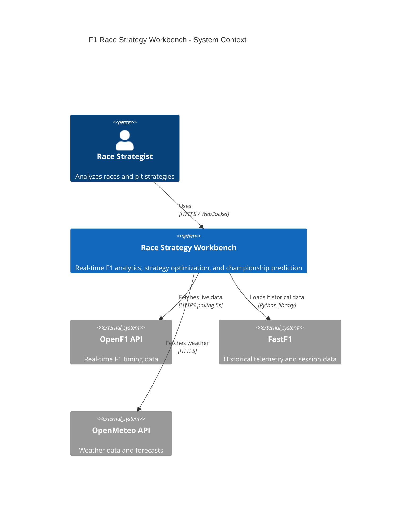
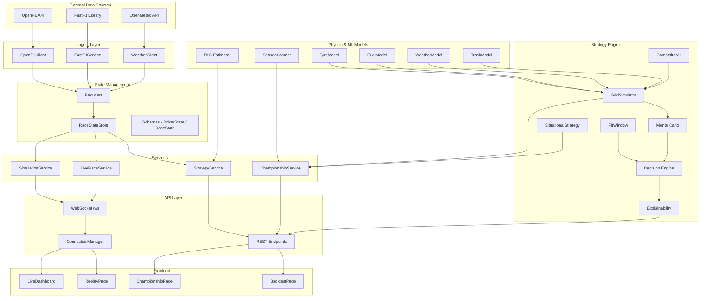
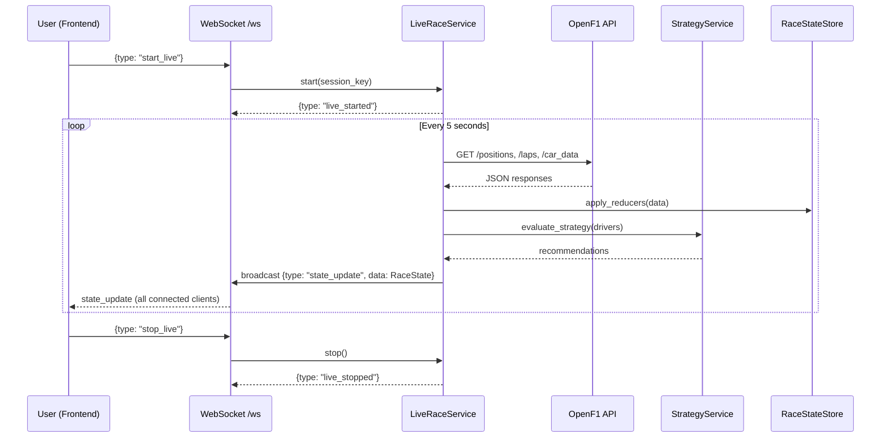
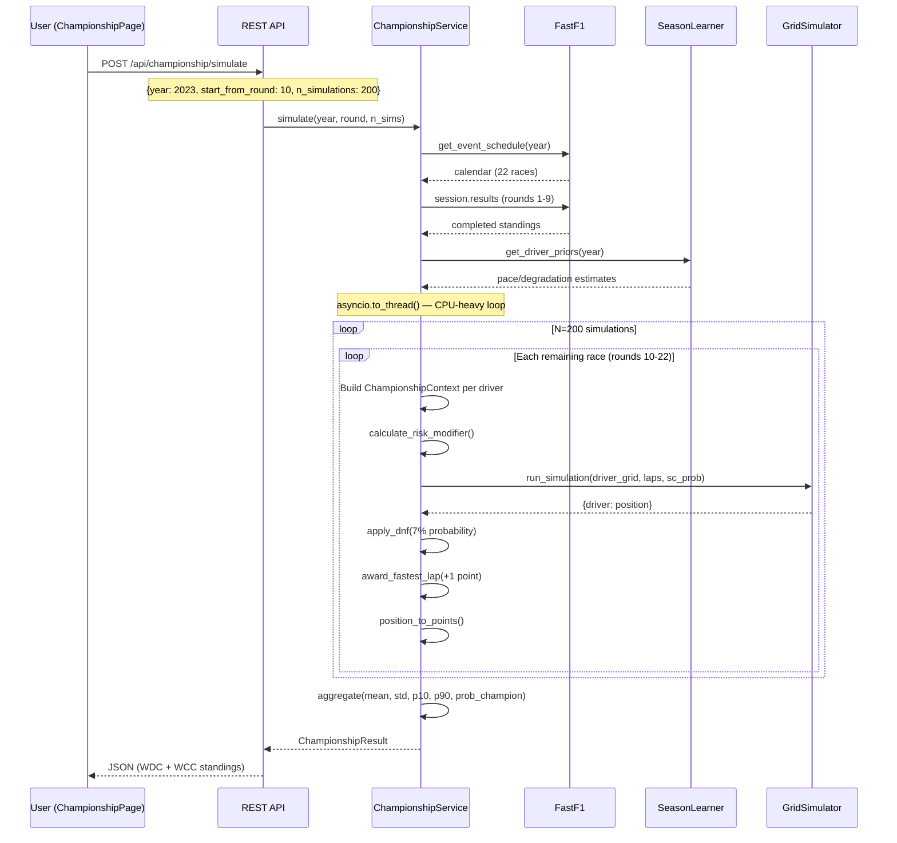
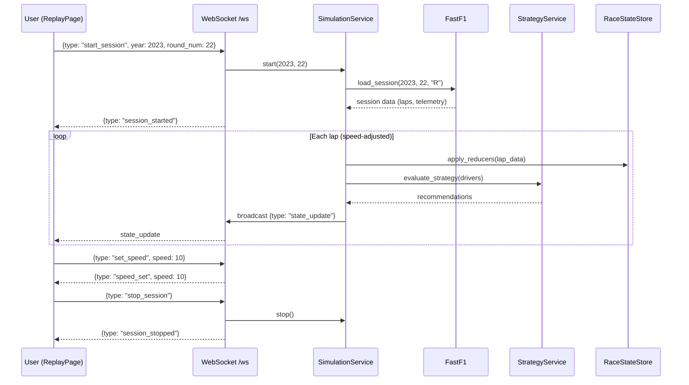
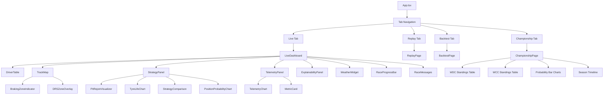
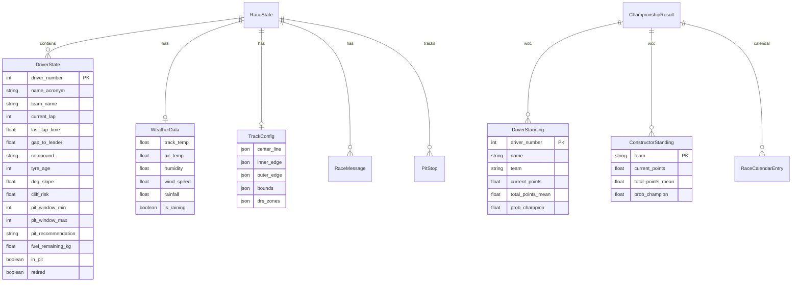
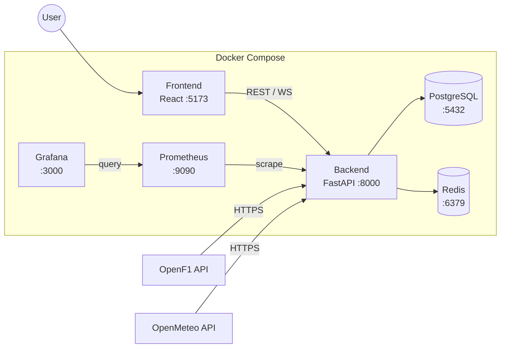
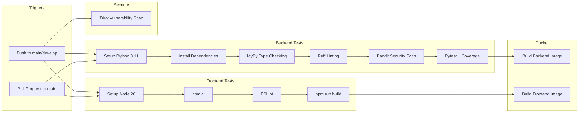

# Architecture Diagrams

Visual architecture diagrams for the F1 Race Strategy Workbench v2.1.

> These diagrams use [Mermaid](https://mermaid.js.org/) syntax and render natively on GitHub.

---

## System Context Diagram

High-level view showing external systems and users.

---

## Component Diagram

Backend service architecture showing internal components.

---

## Live Race Mode — Sequence Diagram

---

## Championship Simulation — Sequence Diagram

---

## Race Simulation (Replay) — Sequence Diagram

---

## Frontend Component Tree

---

## Data Model — Entity Relationship

---

## Infrastructure — Docker Compose Stack

---

## CI/CD Pipeline

