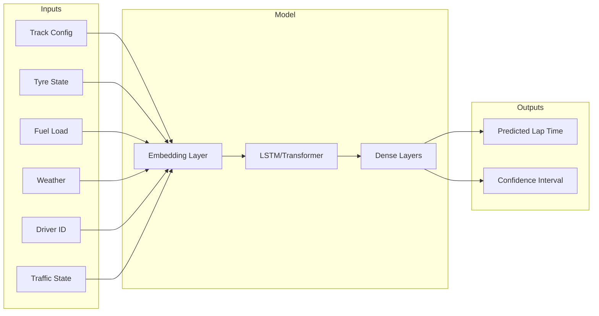
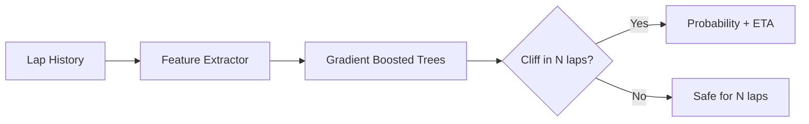

# Phase 1: Intelligence Upgrade — Implementation Plan

> **Version Target:** Apex v3.0  
> **Theme:** Transform Apex into a truly *predictive* platform with advanced ML capabilities

---

## Overview

This phase focuses on adding sophisticated machine learning models that predict race outcomes with higher accuracy than the current Monte Carlo approach. The goal is to move from statistical simulation to *learned* patterns from historical F1 data.

### Features in This Phase

| # | Feature | Priority | Complexity |
|---|---------|----------|------------|
| 1 | Neural Network Pace Prediction | High | High |
| 2 | Tyre Cliff Detection Model | High | Medium |
| 3 | Battle Prediction System | High | Medium |
| 4 | Fuel-Corrected Lap Time Analysis | Medium | Low |

---

## Feature 1: Neural Network Pace Prediction

### Problem Statement
Current pace prediction relies on RLS estimators that only use recent laps. This misses track-specific patterns, driver tendencies, and compound behavior that can be learned from historical data.

### Solution
Train a neural network on 3+ years of F1 lap data to predict lap times given:
- Track characteristics (sector lengths, corners, elevation)
- Tyre compound and age
- Fuel load
- Weather conditions
- Driver/car combination
- Track position (clean air vs traffic)

### Architecture



### Data Requirements

| Source | Data | Volume |
|--------|------|--------|
| FastF1 | Historical lap times (2021-2024) | ~500K laps |
| FastF1 | Telemetry data | ~50GB |
| OpenF1 | Real-time lap data | Streaming |
| Weather API | Historical weather | ~1000 sessions |

### Proposed Changes

---

#### Backend

##### [NEW] [src/rsw/models/ml/pace_predictor.py](file:///Users/cagancaliskan/Desktop/F1/src/rsw/models/ml/pace_predictor.py)

```python
"""
Neural network pace prediction model.

Uses PyTorch for training and inference with ONNX export for fast serving.
"""

class PacePredictor:
    """Main pace prediction model."""
    
    def __init__(self, model_path: str | None = None):
        """Load pretrained model or initialize fresh."""
        
    def predict(
        self,
        track_id: str,
        driver_id: int,
        tyre_compound: str,
        tyre_age: int,
        fuel_load_kg: float,
        air_temp: float,
        track_temp: float,
        in_traffic: bool = False
    ) -> PacePrediction:
        """Predict lap time for given conditions."""
        
    def predict_stint(
        self,
        track_id: str,
        driver_id: int,
        tyre_compound: str,
        start_fuel_kg: float,
        stint_length: int,
        conditions: WeatherConditions
    ) -> list[PacePrediction]:
        """Predict full stint of lap times."""

@dataclass
class PacePrediction:
    """Single lap time prediction with uncertainty."""
    predicted_time: float
    confidence_lower: float
    confidence_upper: float
    degradation_component: float
    fuel_component: float
```

##### [NEW] [src/rsw/models/ml/training/pace_trainer.py](file:///Users/cagancaliskan/Desktop/F1/src/rsw/models/ml/training/pace_trainer.py)

Training pipeline for the pace prediction model:
- Data loading from FastF1 cache
- Feature engineering pipeline
- Model architecture (PyTorch)
- Training loop with validation
- ONNX export for inference

##### [NEW] [src/rsw/models/ml/training/data_loader.py](file:///Users/cagancaliskan/Desktop/F1/src/rsw/models/ml/training/data_loader.py)

Data loading utilities:
- FastF1 session loader
- Lap data normalization
- Feature extraction
- Train/val/test splits

##### [MODIFY] [src/rsw/strategy/monte_carlo.py](file:///Users/cagancaliskan/Desktop/F1/src/rsw/strategy/monte_carlo.py)

Update `simulate_single_race()` to use `PacePredictor` instead of linear degradation:

```diff
- lap_time = driver_pace + driver_deg * lap
+ lap_time = self.pace_predictor.predict(
+     track_id=self.track_id,
+     driver_id=driver_number,
+     tyre_compound=current_compound,
+     tyre_age=lap - last_pit_lap,
+     fuel_load_kg=starting_fuel - (fuel_per_lap * lap),
+     ...
+ ).predicted_time
```

##### [NEW] [src/rsw/ingest/fastf1_client.py](file:///Users/cagancaliskan/Desktop/F1/src/rsw/ingest/fastf1_client.py)

FastF1 data provider for historical data:
- Session loading with caching
- Lap data extraction
- Telemetry data extraction
- Weather data extraction

##### [MODIFY] [src/rsw/container.py](file:///Users/cagancaliskan/Desktop/F1/src/rsw/container.py)

Register new services:

```diff
+ from rsw.models.ml.pace_predictor import PacePredictor
+ 
+ # In Container initialization
+ Container.register(PacePredictor, PacePredictor(model_path="models/pace_v1.onnx"))
```

---

#### API

##### [NEW] [src/rsw/api/routes/predictions.py](file:///Users/cagancaliskan/Desktop/F1/src/rsw/api/routes/predictions.py)

```python
@router.get("/api/predictions/pace/{driver_number}")
async def predict_pace(
    driver_number: int,
    laps_ahead: int = 5,
    state: RaceStateStore = Depends(get_state_store),
    predictor: PacePredictor = Depends(get_pace_predictor)
) -> PacePredictionResponse:
    """Get predicted lap times for next N laps."""
    
@router.get("/api/predictions/stint/{driver_number}")
async def predict_stint(
    driver_number: int,
    compound: str,
    stint_length: int,
    ...
) -> StintPredictionResponse:
    """Predict full stint performance on given compound."""
```

##### [MODIFY] [src/rsw/main.py](file:///Users/cagancaliskan/Desktop/F1/src/rsw/main.py)

Include new router:

```diff
+ from rsw.api.routes.predictions import router as predictions_router
+ app.include_router(predictions_router)
```

---

#### Frontend

##### [NEW] [frontend/src/components/PacePredictionChart.tsx](file:///Users/cagancaliskan/Desktop/F1/frontend/src/components/PacePredictionChart.tsx)

Line chart showing:
- Actual lap times (solid line)
- Predicted lap times (dashed line)
- Confidence bands (shaded area)
- Projected vs actual delta

##### [MODIFY] [frontend/src/components/StrategyPanel.tsx](file:///Users/cagancaliskan/Desktop/F1/frontend/src/components/StrategyPanel.tsx)

Add pace prediction visualization:

```diff
+ import { PacePredictionChart } from './PacePredictionChart';
+ 
+ // In StrategyPanel render
+ <PacePredictionChart
+   driverNumber={selectedDriver}
+   lapsAhead={10}
+ />
```

---

#### Data Files

##### [NEW] [models/pace_v1.onnx](file:///Users/cagancaliskan/Desktop/F1/models/pace_v1.onnx)

Pretrained ONNX model (generated by training pipeline)

##### [NEW] [data/training/track_configs.json](file:///Users/cagancaliskan/Desktop/F1/data/training/track_configs.json)

Track-specific configuration data:
- Sector lengths
- Number of corners
- DRS zones
- Average lap characteristics

---

## Feature 2: Tyre Cliff Detection

### Problem Statement
Tyres don't degrade linearly—they hit a "cliff" where performance drops dramatically. Current models miss this critical event.

### Solution
Train a classifier to predict when tyres will cliff based on:
- Current degradation rate
- Tyre age
- Track abrasiveness
- Historical compound behavior at this track

### Architecture



### Proposed Changes

---

##### [NEW] [src/rsw/models/ml/cliff_detector.py](file:///Users/cagancaliskan/Desktop/F1/src/rsw/models/ml/cliff_detector.py)

```python
"""
Tyre cliff prediction using gradient boosted classifier.

Uses scikit-learn for fast inference.
"""

class CliffDetector:
    """Predict when tyres will hit performance cliff."""
    
    def predict_cliff(
        self,
        compound: str,
        tyre_age: int,
        deg_history: list[float],  # Last N laps degradation
        track_id: str,
        track_temp: float
    ) -> CliffPrediction:
        """Predict cliff probability and ETA."""

@dataclass
class CliffPrediction:
    """Cliff prediction result."""
    cliff_probability: float  # 0-1 probability of cliff in next 5 laps
    estimated_laps_to_cliff: int | None  # None if no cliff predicted
    confidence: float
    recommendation: Literal["SAFE", "MONITOR", "PIT_SOON", "PIT_NOW"]
```

##### [NEW] [src/rsw/models/ml/training/cliff_trainer.py](file:///Users/cagancaliskan/Desktop/F1/src/rsw/models/ml/training/cliff_trainer.py)

Training pipeline for cliff detection:
- Historical cliff identification (manual labeling + heuristics)
- Feature engineering
- XGBoost/LightGBM model
- Model serialization

##### [MODIFY] [src/rsw/strategy/decision.py](file:///Users/cagancaliskan/Desktop/F1/src/rsw/strategy/decision.py)

Integrate cliff prediction into strategy decisions:

```diff
+ from rsw.models.ml.cliff_detector import CliffDetector
+ 
+ def evaluate_strategy(...) -> StrategyRecommendation:
+     # Check cliff risk
+     cliff_pred = cliff_detector.predict_cliff(...)
+     if cliff_pred.recommendation == "PIT_NOW":
+         return StrategyRecommendation(
+             recommendation=Recommendation.PIT_NOW,
+             confidence=cliff_pred.confidence,
+             explanation=f"Tyre cliff imminent in {cliff_pred.estimated_laps_to_cliff} laps"
+         )
```

---

#### API

##### [NEW] [src/rsw/api/routes/predictions.py](file:///Users/cagancaliskan/Desktop/F1/src/rsw/api/routes/predictions.py) (add to existing)

```python
@router.get("/api/predictions/cliff/{driver_number}")
async def predict_cliff(
    driver_number: int,
    ...
) -> CliffPredictionResponse:
    """Get tyre cliff prediction for driver."""
```

---

#### Frontend

##### [NEW] [frontend/src/components/CliffWarning.tsx](file:///Users/cagancaliskan/Desktop/F1/frontend/src/components/CliffWarning.tsx)

Visual cliff warning indicator:
- Color-coded warning (green/yellow/orange/red)
- ETA countdown
- Animated alert when imminent

##### [MODIFY] [frontend/src/components/TyreLifeChart.tsx](file:///Users/cagancaliskan/Desktop/F1/frontend/src/components/TyreLifeChart.tsx)

Add cliff prediction overlay:
- Vertical line showing predicted cliff point
- Shaded danger zone

---

## Feature 3: Battle Prediction System

### Problem Statement
Users want to know when exciting battles will happen—when will two drivers be racing for position?

### Solution
Analyze gap trends and pace differentials to predict when drivers will be within DRS range.

### Proposed Changes

---

##### [NEW] [src/rsw/models/ml/battle_predictor.py](file:///Users/cagancaliskan/Desktop/F1/src/rsw/models/ml/battle_predictor.py)

```python
"""
Battle prediction based on gap trends and pace differentials.
"""

class BattlePredictor:
    """Predict when drivers will battle for position."""
    
    def predict_battles(
        self,
        race_state: RaceState,
        laps_ahead: int = 10
    ) -> list[BattlePrediction]:
        """Predict all upcoming battles."""
    
    def predict_drs_proximity(
        self,
        driver_ahead: int,
        driver_behind: int,
        race_state: RaceState
    ) -> DRSProximityPrediction:
        """Predict when driver_behind will be in DRS range."""

@dataclass
class BattlePrediction:
    """Predicted battle between two drivers."""
    driver_ahead: int
    driver_behind: int
    estimated_lap: int
    battle_probability: float
    predicted_outcome: Literal["OVERTAKE", "DEFENSE", "UNCERTAIN"]
    drs_factor: float  # How much DRS helps attacker
```

##### [MODIFY] [src/rsw/services/simulation_service.py](file:///Users/cagancaliskan/Desktop/F1/src/rsw/services/simulation_service.py)

Add battle predictions to WebSocket updates:

```diff
+ battle_predictor = BattlePredictor()
+ 
+ async def broadcast_update(...):
+     battles = battle_predictor.predict_battles(race_state)
+     await websocket.send_json({
+         "type": "battles",
+         "data": [b.dict() for b in battles]
+     })
```

---

#### Frontend

##### [NEW] [frontend/src/components/BattleTracker.tsx](file:///Users/cagancaliskan/Desktop/F1/frontend/src/components/BattleTracker.tsx)

Real-time battle prediction panel:
- List of predicted battles with ETA
- Gap trend arrows (converging/diverging)
- Overtake probability meter
- DRS effectiveness indicator

##### [MODIFY] [frontend/src/pages/LiveDashboard.tsx](file:///Users/cagancaliskan/Desktop/F1/frontend/src/pages/LiveDashboard.tsx)

Add BattleTracker component to dashboard layout.

---

## Feature 4: Fuel-Corrected Lap Time Analysis

### Problem Statement
Raw lap times don't show true pace because fuel load affects performance (~0.03s per kg). Users need fuel-corrected times to understand real pace.

### Proposed Changes

---

##### [NEW] [src/rsw/models/physics/fuel_correction.py](file:///Users/cagancaliskan/Desktop/F1/src/rsw/models/physics/fuel_correction.py)

```python
"""
Fuel load correction for lap time analysis.
"""

# Constants
FUEL_EFFECT_PER_KG = 0.03  # seconds per kg
STARTING_FUEL_KG = 110.0  # Max fuel load
FUEL_CONSUMPTION_PER_LAP = {
    "monaco": 1.8,
    "spa": 2.5,
    "monza": 2.2,
    # ... per track
}

def correct_for_fuel(
    lap_time: float,
    lap_number: int,
    total_laps: int,
    track_id: str
) -> float:
    """Return fuel-corrected lap time."""
    
def estimate_fuel_load(
    lap_number: int,
    total_laps: int,
    track_id: str
) -> float:
    """Estimate remaining fuel in kg."""
```

##### [MODIFY] [src/rsw/state/schemas.py](file:///Users/cagancaliskan/Desktop/F1/src/rsw/state/schemas.py)

Add fuel-corrected time to DriverState:

```diff
class DriverState(BaseModel):
    ...
    last_lap_time: float | None = None
+   fuel_corrected_lap_time: float | None = None
```

##### [MODIFY] [src/rsw/state/reducers.py](file:///Users/cagancaliskan/Desktop/F1/src/rsw/state/reducers.py)

Calculate fuel-corrected time when processing laps.

---

#### Frontend

##### [MODIFY] [frontend/src/components/DriverTable.tsx](file:///Users/cagancaliskan/Desktop/F1/frontend/src/components/DriverTable.tsx)

Add column toggle for fuel-corrected lap times:

```diff
+ <th>Fuel-Corrected</th>
+ ...
+ <td>{driver.fuelCorrectedLapTime?.toFixed(3)}</td>
```

---

## Dependencies

### Python Packages (add to requirements.txt)

```
# ML Stack
torch>=2.0.0              # Neural network training
onnxruntime>=1.15.0       # Fast inference
scikit-learn>=1.3.0       # Gradient boosting, preprocessing
xgboost>=2.0.0            # Cliff detection model
fastf1>=3.0.0             # Historical data access

# Data Processing
polars>=0.19.0            # Fast data frames
pyarrow>=13.0.0           # Parquet support
```

### NPM Packages (add to frontend/package.json)

```json
{
  "dependencies": {
    "d3": "^7.8.0",         // Advanced visualizations
    "framer-motion": "^10.0.0"  // Animations
  }
}
```

---

## Database Schema (Optional)

If persisting predictions:

```sql
CREATE TABLE pace_predictions (
    id SERIAL PRIMARY KEY,
    session_key INT NOT NULL,
    driver_number INT NOT NULL,
    lap_number INT NOT NULL,
    predicted_time FLOAT NOT NULL,
    actual_time FLOAT,
    prediction_error FLOAT,
    created_at TIMESTAMP DEFAULT NOW()
);

CREATE TABLE cliff_events (
    id SERIAL PRIMARY KEY,
    session_key INT NOT NULL,
    driver_number INT NOT NULL,
    compound VARCHAR(20) NOT NULL,
    cliff_lap INT NOT NULL,
    was_predicted BOOLEAN,
    prediction_error INT  -- Laps early/late
);
```

---

## Verification Plan

### Automated Tests

#### Unit Tests

| Test File | Coverage |
|-----------|----------|
| `tests/models/test_pace_predictor.py` | Pace prediction accuracy |
| `tests/models/test_cliff_detector.py` | Cliff detection precision/recall |
| `tests/models/test_battle_predictor.py` | Battle prediction logic |
| `tests/models/test_fuel_correction.py` | Fuel correction calculation |

Run with:
```bash
python run.py --test
# or
pytest tests/models/ -v
```

#### Integration Tests

| Test File | Coverage |
|-----------|----------|
| `tests/integration/test_prediction_api.py` | API endpoint responses |
| `tests/integration/test_websocket_battles.py` | WebSocket battle updates |

Run with:
```bash
pytest tests/integration/ -v
```

### Model Validation

#### Pace Predictor Benchmarks

```bash
# Run offline validation against 2024 data
python scripts/validate_pace_model.py --season 2024 --output reports/pace_validation.html
```

Expected metrics:
- **MAE** (Mean Absolute Error): < 0.3 seconds
- **R²** (Coefficient of Determination): > 0.85
- **Cliff Detection F1**: > 0.75

#### Manual Verification

1. **Visual Inspection**
   - Start app: `python run.py`
   - Open http://localhost:8000
   - Select a live/replay session
   - Verify pace prediction chart shows reasonable predictions
   - Verify cliff warnings appear before actual cliff events

2. **User Acceptance**
   - Compare predictions to actual race outcomes
   - Have domain expert review prediction quality

---

## Implementation Timeline

| Week | Tasks | Deliverables |
|------|-------|--------------|
| 1 | FastF1 integration, data pipeline | Historical data loaded |
| 2 | Pace predictor training | Trained model, validation report |
| 3 | Cliff detector training, API endpoints | Working predictions API |
| 4 | Battle predictor, WebSocket integration | Real-time battles |
| 5 | Frontend components | Visual integration |
| 6 | Testing, validation, polish | Release candidate |

**Total Estimated Effort:** 6 weeks

---

## Risk Assessment

| Risk | Probability | Impact | Mitigation |
|------|-------------|--------|------------|
| Insufficient training data | Medium | High | Use data augmentation, synthetic laps |
| Model accuracy below target | Medium | High | Ensemble methods, more features |
| FastF1 API changes | Low | Medium | Abstract data loading, cache aggressively |
| ONNX inference too slow | Low | Medium | Batch predictions, GPU inference |

---

## Success Metrics

| Metric | Target | Measurement |
|--------|--------|-------------|
| Pace prediction MAE | < 0.3s | Offline validation |
| Cliff prediction F1 | > 0.75 | Offline validation |
| Battle prediction accuracy | > 70% | Post-race analysis |
| User engagement | +30% session duration | Analytics |

---

**Next Phase:** [Phase 2: Visualization Upgrade](./phase2_visualization_upgrade.md)
