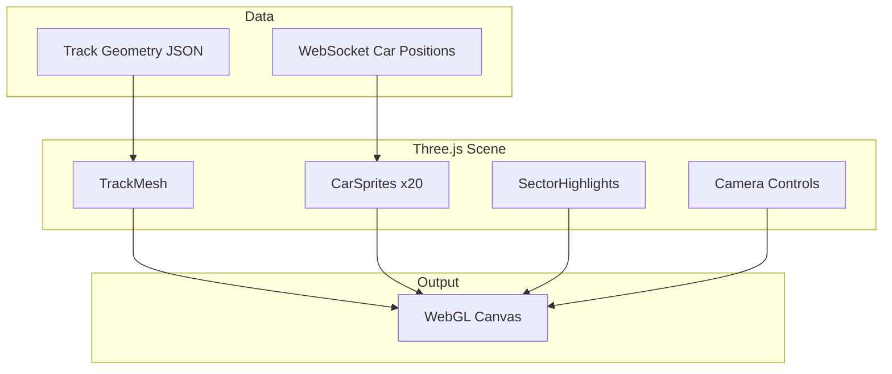
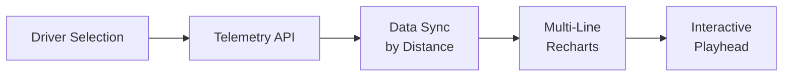

# Phase 2: Visualization Upgrade — Implementation Plan

> **Version Target:** Apex v3.0  
> **Theme:** Make Apex visually stunning and deeply interactive

---

## Overview

This phase focuses on transforming the user experience with cutting-edge visualizations. The goal is to make race data not just informative but *immersive* and *engaging*.

### Features in This Phase

| # | Feature | Priority | Complexity |
|---|---------|----------|------------|
| 1 | 3D WebGL Track Visualization | High | High |
| 2 | Comparative Telemetry Overlays | High | Medium |
| 3 | Lap-by-Lap Animation Replay | Medium | Medium |
| 4 | Mobile-Responsive Dashboard | Medium | Medium |

---

## Feature 1: 3D WebGL Track Visualization

### Problem Statement
The current 2D track map is functional but lacks the visual impact that engages users. A 3D view with animated car positions would create a more immersive experience.

### Solution
Build a Three.js-powered 3D track visualization that:
- Renders accurate 3D circuit geometry with elevation changes
- Shows real-time car positions with team colors
- Supports pan/zoom/rotate camera controls
- Highlights sectors and pit lane

### Architecture



### Track Geometry Data

Each track needs 3D geometry data:

```json
{
  "track_id": "monaco",
  "name": "Circuit de Monaco",
  "centerline": [
    {"x": 0, "y": 0, "z": 0},
    {"x": 10, "y": 0.5, "z": 15},
    // ... hundreds of points
  ],
  "width": 8,
  "sectors": [
    {"start": 0, "end": 0.33, "color": "#FF0000"},
    {"start": 0.33, "end": 0.66, "color": "#00FF00"},
    {"start": 0.66, "end": 1.0, "color": "#0000FF"}
  ],
  "pitlane": {
    "entry": 0.85,
    "exit": 0.05
  }
}
```

### Proposed Changes

---

#### Frontend

##### [NEW] [frontend/src/components/Track3D/Track3D.tsx](file:///Users/cagancaliskan/Desktop/F1/frontend/src/components/Track3D/Track3D.tsx)

Main 3D track component:

```tsx
import { Canvas } from '@react-three/fiber';
import { OrbitControls, PerspectiveCamera } from '@react-three/drei';

interface Track3DProps {
  trackId: string;
  driverPositions: DriverPosition[];
  selectedDriver?: number;
  cameraMode: 'orbit' | 'follow' | 'top-down';
}

export function Track3D({ trackId, driverPositions, selectedDriver, cameraMode }: Track3DProps) {
  return (
    <Canvas>
      <PerspectiveCamera makeDefault position={[0, 100, 0]} />
      <OrbitControls enableDamping />
      
      {/* Lighting */}
      <ambientLight intensity={0.5} />
      <directionalLight position={[10, 20, 10]} intensity={1} />
      
      {/* Track */}
      <TrackMesh trackId={trackId} />
      <SectorHighlights trackId={trackId} />
      <PitLane trackId={trackId} />
      
      {/* Cars */}
      {driverPositions.map(driver => (
        <CarMarker
          key={driver.number}
          position={driver.position3D}
          color={driver.teamColor}
          isSelected={driver.number === selectedDriver}
          label={driver.abbreviation}
        />
      ))}
    </Canvas>
  );
}
```

##### [NEW] [frontend/src/components/Track3D/TrackMesh.tsx](file:///Users/cagancaliskan/Desktop/F1/frontend/src/components/Track3D/TrackMesh.tsx)

Track geometry renderer:
- Load track geometry from JSON
- Build extruded path mesh
- Apply materials (asphalt, kerbs, grass)

##### [NEW] [frontend/src/components/Track3D/CarMarker.tsx](file:///Users/cagancaliskan/Desktop/F1/frontend/src/components/Track3D/CarMarker.tsx)

Individual car markers:
- 3D car model or simplified sprite
- Team color shader
- Hover tooltip with driver info
- Selection highlight

##### [NEW] [frontend/src/components/Track3D/CameraController.tsx](file:///Users/cagancaliskan/Desktop/F1/frontend/src/components/Track3D/CameraController.tsx)

Camera modes:
- **Orbit**: Free rotation around track center
- **Follow**: Chase camera behind selected driver
- **Top-Down**: Bird's eye overview
- **Onboard**: First-person from car (stretch goal)

##### [NEW] [frontend/src/components/Track3D/track-geometries/](file:///Users/cagancaliskan/Desktop/F1/frontend/src/components/Track3D/track-geometries/)

JSON files for each circuit:
- `monaco.json`
- `silverstone.json`
- `spa.json`
- `monza.json`
- ... (24 tracks total)

##### [MODIFY] [frontend/src/pages/LiveDashboard.tsx](file:///Users/cagancaliskan/Desktop/F1/frontend/src/pages/LiveDashboard.tsx)

Add toggle between 2D and 3D views:

```diff
+ import { Track3D } from '../components/Track3D/Track3D';
+ 
+ const [viewMode, setViewMode] = useState<'2d' | '3d'>('3d');
+ 
+ {viewMode === '3d' ? (
+   <Track3D 
+     trackId={session.trackId}
+     driverPositions={driverPositions}
+     selectedDriver={selectedDriver}
+   />
+ ) : (
+   <TrackMap ... />
+ )}
```

---

#### Backend

##### [NEW] [src/rsw/api/routes/tracks.py](file:///Users/cagancaliskan/Desktop/F1/src/rsw/api/routes/tracks.py)

Track geometry API:

```python
@router.get("/api/tracks/{track_id}/geometry")
async def get_track_geometry(track_id: str) -> TrackGeometry:
    """Get 3D geometry for track visualization."""
    
@router.get("/api/tracks")
async def list_tracks() -> list[TrackInfo]:
    """List all available tracks with metadata."""
```

##### [NEW] [data/tracks/](file:///Users/cagancaliskan/Desktop/F1/data/tracks/)

Track geometry JSON files served by API.

---

## Feature 2: Comparative Telemetry Overlays

### Problem Statement
Users want to compare driver performances side-by-side to understand pace differences, braking points, and racing lines.

### Solution
Multi-driver telemetry comparison tool:
- Select 2-4 drivers to compare
- Overlay speed traces, throttle, brake
- Synchronized playback by track position
- Delta time visualization

### Architecture



### Proposed Changes

---

#### Frontend

##### [NEW] [frontend/src/components/TelemetryComparison.tsx](file:///Users/cagancaliskan/Desktop/F1/frontend/src/components/TelemetryComparison.tsx)

Main comparison component:

```tsx
interface TelemetryComparisonProps {
  drivers: number[];  // 2-4 driver numbers
  lap: number;
  channels: ('speed' | 'throttle' | 'brake' | 'gear' | 'drs')[];
}

export function TelemetryComparison({ drivers, lap, channels }: TelemetryComparisonProps) {
  const [telemetryData, setTelemetryData] = useState<TelemetryFrame[][]>([]);
  const [playheadPosition, setPlayheadPosition] = useState(0);
  
  return (
    <div className="telemetry-comparison">
      {/* Driver selector */}
      <DriverSelector 
        selected={drivers}
        maxSelection={4}
        onChange={setDrivers}
      />
      
      {/* Channel toggles */}
      <ChannelToggles channels={channels} />
      
      {/* Main chart */}
      <TelemetryOverlayChart
        data={telemetryData}
        channels={channels}
        playhead={playheadPosition}
      />
      
      {/* Playback controls */}
      <PlaybackScrubber
        position={playheadPosition}
        onSeek={setPlayheadPosition}
      />
      
      {/* Delta time display */}
      <DeltaTimePanel drivers={drivers} position={playheadPosition} />
    </div>
  );
}
```

##### [NEW] [frontend/src/components/TelemetryOverlayChart.tsx](file:///Users/cagancaliskan/Desktop/F1/frontend/src/components/TelemetryOverlayChart.tsx)

Multi-line Recharts visualization:
- X-axis: track distance (meters)
- Y-axis: channel value (speed, %, gear)
- Color-coded by driver/team
- Synced vertical cursor
- Delta annotations at key points (braking zones, apex)

##### [MODIFY] [frontend/src/components/TelemetryChart.tsx](file:///Users/cagancaliskan/Desktop/F1/frontend/src/components/TelemetryChart.tsx)

Add "Compare" button to existing single-driver telemetry view.

---

#### Backend

##### [NEW] [src/rsw/api/routes/telemetry.py](file:///Users/cagancaliskan/Desktop/F1/src/rsw/api/routes/telemetry.py)

```python
@router.get("/api/telemetry/{session_key}/lap/{lap}")
async def get_lap_telemetry(
    session_key: int,
    lap: int,
    drivers: list[int] = Query(...)
) -> dict[int, list[TelemetryFrame]]:
    """Get telemetry for multiple drivers for a specific lap."""

@router.get("/api/telemetry/{session_key}/fastest")
async def get_fastest_lap_comparison(
    session_key: int,
    drivers: list[int] = Query(...)
) -> dict[int, LapTelemetry]:
    """Get fastest lap telemetry for comparison."""
```

##### [MODIFY] [src/rsw/ingest/openf1_client.py](file:///Users/cagancaliskan/Desktop/F1/src/rsw/ingest/openf1_client.py)

Add telemetry fetching:

```diff
+ async def get_car_telemetry(
+     self,
+     session_key: int,
+     driver_number: int,
+     lap: int | None = None
+ ) -> list[TelemetryFrame]:
+     """Get car telemetry (speed, throttle, brake, etc.)."""
```

---

## Feature 3: Lap-by-Lap Animation Replay

### Problem Statement
Historical race replay lacks engagement. Users want to "watch" the race unfold with animated position changes.

### Solution
Animated replay mode that:
- Shows lap-by-lap position changes with smooth transitions
- Highlights overtakes and pit stops
- Allows pause/play/rewind
- Variable speed playback (0.1x to 10x)

### Proposed Changes

---

#### Frontend

##### [NEW] [frontend/src/components/AnimatedReplay/AnimatedReplay.tsx](file:///Users/cagancaliskan/Desktop/F1/frontend/src/components/AnimatedReplay/AnimatedReplay.tsx)

```tsx
interface AnimatedReplayProps {
  sessionKey: number;
  raceData: LapByLapData;
}

export function AnimatedReplay({ sessionKey, raceData }: AnimatedReplayProps) {
  const [currentLap, setCurrentLap] = useState(1);
  const [isPlaying, setIsPlaying] = useState(false);
  const [playbackSpeed, setPlaybackSpeed] = useState(1);
  
  return (
    <div className="animated-replay">
      {/* Track visualization */}
      <Track3D
        trackId={raceData.trackId}
        driverPositions={getPositionsAtLap(currentLap)}
        animationMode={true}
      />
      
      {/* Position tower with animations */}
      <AnimatedPositionTower
        positions={raceData.positions[currentLap]}
        previousPositions={raceData.positions[currentLap - 1]}
      />
      
      {/* Timeline scrubber */}
      <LapTimeline
        totalLaps={raceData.totalLaps}
        currentLap={currentLap}
        onSeek={setCurrentLap}
        events={raceData.events}  // pit stops, overtakes, etc.
      />
      
      {/* Playback controls */}
      <PlaybackControls
        isPlaying={isPlaying}
        speed={playbackSpeed}
        onPlayPause={() => setIsPlaying(!isPlaying)}
        onSpeedChange={setPlaybackSpeed}
        onPrevLap={() => setCurrentLap(Math.max(1, currentLap - 1))}
        onNextLap={() => setCurrentLap(Math.min(raceData.totalLaps, currentLap + 1))}
      />
      
      {/* Event annotations */}
      <EventOverlay events={raceData.events.filter(e => e.lap === currentLap)} />
    </div>
  );
}
```

##### [NEW] [frontend/src/components/AnimatedReplay/AnimatedPositionTower.tsx](file:///Users/cagancaliskan/Desktop/F1/frontend/src/components/AnimatedReplay/AnimatedPositionTower.tsx)

Position tower with Framer Motion animations:
- Smooth position swaps on overtakes
- Pit stop indicators
- Gap visualization
- Driver portraits/team colors

##### [NEW] [frontend/src/components/AnimatedReplay/LapTimeline.tsx](file:///Users/cagancaliskan/Desktop/F1/frontend/src/components/AnimatedReplay/LapTimeline.tsx)

Scrubber timeline:
- Lap numbers along bottom
- Event markers (SC, VSC, pit stops)
- Draggable playhead
- Keyboard navigation (←/→)

##### [MODIFY] [frontend/src/pages/ReplayPage.tsx](file:///Users/cagancaliskan/Desktop/F1/frontend/src/pages/ReplayPage.tsx)

Integrate animated replay:

```diff
+ import { AnimatedReplay } from '../components/AnimatedReplay/AnimatedReplay';
+ 
+ {replayMode === 'animated' && (
+   <AnimatedReplay sessionKey={sessionKey} raceData={raceData} />
+ )}
```

---

#### Backend

##### [MODIFY] [src/rsw/api/routes/replay.py](file:///Users/cagancaliskan/Desktop/F1/src/rsw/api/routes/replay.py)

Add endpoint for structured race timeline:

```python
@router.get("/api/replay/{session_key}/timeline")
async def get_race_timeline(session_key: int) -> RaceTimeline:
    """Get lap-by-lap positions and events for animated replay."""
    return RaceTimeline(
        session_key=session_key,
        total_laps=total_laps,
        positions={lap: [...] for lap in range(1, total_laps + 1)},
        events=[...]  # Pit stops, overtakes, safety cars
    )
```

##### [NEW] [src/rsw/services/event_detector.py](file:///Users/cagancaliskan/Desktop/F1/src/rsw/services/event_detector.py)

Detect race events from lap data:
- Overtakes: position change between laps
- Pit stops: pit out flag
- Safety car: reduced lap times cluster
- Retirements: driver disappears

---

## Feature 4: Mobile-Responsive Dashboard

### Problem Statement
Current dashboard is desktop-focused. Mobile users (e.g., at the track) need a responsive experience.

### Solution
Redesign with mobile-first CSS and component restructuring:
- Stack layout on mobile
- Touch-friendly controls
- Reduced data density
- Essential-only view modes

### Proposed Changes

---

#### Frontend

##### [MODIFY] [frontend/src/index.css](file:///Users/cagancaliskan/Desktop/F1/frontend/src/index.css)

Add responsive breakpoints:

```css
/* Mobile-first base styles */
.dashboard-grid {
  display: grid;
  gap: 1rem;
  grid-template-columns: 1fr;
}

/* Tablet */
@media (min-width: 768px) {
  .dashboard-grid {
    grid-template-columns: 1fr 1fr;
  }
}

/* Desktop */
@media (min-width: 1200px) {
  .dashboard-grid {
    grid-template-columns: 2fr 1fr 1fr;
  }
}

/* Touch-friendly buttons */
@media (pointer: coarse) {
  .control-button {
    min-height: 48px;
    min-width: 48px;
  }
}
```

##### [NEW] [frontend/src/hooks/useResponsive.ts](file:///Users/cagancaliskan/Desktop/F1/frontend/src/hooks/useResponsive.ts)

```tsx
export function useResponsive() {
  const [breakpoint, setBreakpoint] = useState<'mobile' | 'tablet' | 'desktop'>('desktop');
  
  useEffect(() => {
    const updateBreakpoint = () => {
      if (window.innerWidth < 768) setBreakpoint('mobile');
      else if (window.innerWidth < 1200) setBreakpoint('tablet');
      else setBreakpoint('desktop');
    };
    
    window.addEventListener('resize', updateBreakpoint);
    updateBreakpoint();
    return () => window.removeEventListener('resize', updateBreakpoint);
  }, []);
  
  return {
    breakpoint,
    isMobile: breakpoint === 'mobile',
    isTablet: breakpoint === 'tablet',
    isDesktop: breakpoint === 'desktop',
  };
}
```

##### [MODIFY] [frontend/src/pages/LiveDashboard.tsx](file:///Users/cagancaliskan/Desktop/F1/frontend/src/pages/LiveDashboard.tsx)

Conditional rendering by breakpoint:

```diff
+ import { useResponsive } from '../hooks/useResponsive';
+ 
+ const { isMobile, isTablet } = useResponsive();
+ 
+ return (
+   <div className="dashboard-grid">
+     {/* Always show track and positions */}
+     <TrackSection />
+     <PositionTower />
+     
+     {/* Tablet and up: show strategy */}
+     {!isMobile && <StrategyPanel />}
+     
+     {/* Desktop only: show telemetry */}
+     {isDesktop && <TelemetryPanel />}
+     
+     {/* Mobile: expandable panels */}
+     {isMobile && <MobileAccordion panels={[...]} />}
+   </div>
+ );
```

##### [NEW] [frontend/src/components/MobileAccordion.tsx](file:///Users/cagancaliskan/Desktop/F1/frontend/src/components/MobileAccordion.tsx)

Collapsible panel container for mobile:
- Touch-friendly expand/collapse
- Only one panel open at a time
- Smooth animations

---

## Dependencies

### NPM Packages (add to frontend/package.json)

```json
{
  "dependencies": {
    "@react-three/fiber": "^8.15.0",    // React Three.js bindings
    "@react-three/drei": "^9.88.0",      // Three.js helpers
    "three": "^0.158.0",                  // Three.js core
    "framer-motion": "^10.16.0",          // Animations
    "use-gesture": "^10.3.0"              // Touch gestures
  }
}
```

### Python Packages

No additional backend dependencies required.

---

## Asset Requirements

### 3D Track Geometries

Track geometry can be sourced from:
1. **FastF1 telemetry**: Extract track shape from driver GPS
2. **OpenStreetMap**: Some circuits have vector data
3. **Manual creation**: Create in Blender, export as JSON

Each track JSON file should be ~50-200KB.

### Car Models (Optional)

For enhanced realism:
- Low-poly F1 car model (~5K triangles)
- Team livery textures (2024 season)
- GLTF format for efficient loading

---

## Verification Plan

### Automated Tests

#### Unit Tests

| Test File | Coverage |
|-----------|----------|
| `frontend/src/components/Track3D/__tests__/Track3D.test.tsx` | Component rendering |
| `frontend/src/components/TelemetryComparison/__tests__/TelemetryComparison.test.tsx` | Data sync logic |
| `frontend/src/hooks/__tests__/useResponsive.test.ts` | Breakpoint detection |

Run with:
```bash
cd frontend && npm test
```

#### Visual Regression Tests

Using Playwright:
```bash
cd frontend && npx playwright test --project=visual
```

### Manual Verification

#### 3D Track Visualization

1. Start app: `python run.py`
2. Open http://localhost:8000
3. Navigate to Live Dashboard
4. Toggle to "3D View"
5. **Verify:**
   - Track renders correctly for each circuit
   - Car positions update in real-time
   - Camera controls work (orbit, zoom, pan)
   - Performance is smooth (60fps)

#### Telemetry Comparison

1. Open any race replay
2. Click "Compare Telemetry"
3. Select 2-4 drivers
4. **Verify:**
   - All driver traces visible
   - Playhead syncs across traces
   - Delta time updates correctly
   - Speed values match expected

#### Mobile Responsiveness

1. Open Chrome DevTools
2. Toggle device toolbar (Ctrl+Shift+M)
3. Test at: 375px, 768px, 1200px widths
4. **Verify:**
   - Layout adapts correctly
   - Touch targets are minimum 48px
   - No horizontal scrolling
   - All features accessible

---

## Implementation Timeline

| Week | Tasks | Deliverables |
|------|-------|--------------|
| 1 | Three.js setup, basic track mesh | 3D canvas rendering |
| 2 | Car markers, camera controls | Interactive 3D track |
| 3 | Telemetry comparison component | Side-by-side comparison |
| 4 | Animated replay system | Lap-by-lap playback |
| 5 | Mobile responsiveness, polish | Responsive dashboard |

**Total Estimated Effort:** 5 weeks

---

## Risk Assessment

| Risk | Probability | Impact | Mitigation |
|------|-------------|--------|------------|
| WebGL performance issues | Medium | High | Level-of-detail, instancing, fallback to 2D |
| Track geometry accuracy | Medium | Medium | Validate against telemetry, iterate |
| Three.js learning curve | Medium | Medium | Use drei helpers, reference examples |
| Mobile performance | Medium | Medium | Reduce geometry, disable effects on mobile |

---

## Success Metrics

| Metric | Target | Measurement |
|--------|--------|-------------|
| 3D render FPS | > 30fps on mid-tier devices | Chrome DevTools |
| Mobile Lighthouse score | > 80 | Lighthouse audit |
| User engagement | +50% time on page | Analytics |
| Comparison feature usage | > 20% of sessions | Feature tracking |

---

## Technical Notes

### Three.js Performance Tips

1. **Instance meshes** for car markers (20 cars = 1 draw call)
2. **LOD system** for track detail based on zoom
3. **Bake lighting** into track texture
4. **Use BufferGeometry** for track path
5. **Dispose resources** on unmount

### Telemetry Data Sync

Synchronize by **track distance**, not time:

```ts
function syncByDistance(traces: TelemetryTrace[], distance: number) {
  return traces.map(trace => {
    const frame = trace.find(f => f.distance >= distance);
    return frame || trace[trace.length - 1];
  });
}
```

---

**Next Phase:** [Phase 3: Full Race Lifecycle](./phase3_full_race_lifecycle.md)
