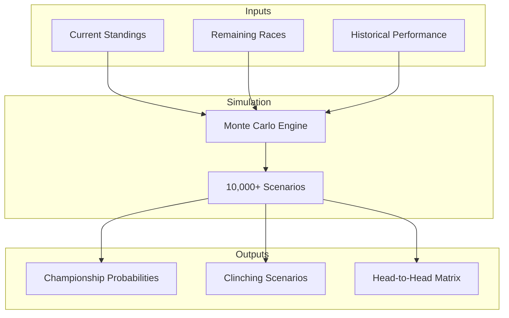
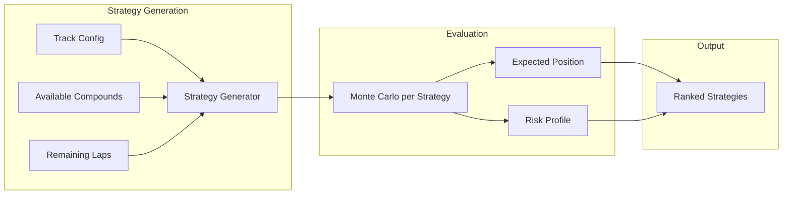

# Phase 3: Full Race Lifecycle — Implementation Plan

> **Version Target:** Apex v3.0  
> **Theme:** Extend Apex beyond race day to cover the entire F1 season lifecycle

---

## Overview

This phase extends Apex's utility beyond live race analysis to cover pre-race planning, championship projections, and post-race reporting. The goal is to make Apex valuable throughout the entire F1 season.

### Features in This Phase

| # | Feature | Priority | Complexity |
|---|---------|----------|------------|
| 1 | Championship Standings Simulator | High | Medium |
| 2 | Multi-Stop Strategy Optimizer | High | High |
| 3 | Post-Race Analysis Reports | Medium | Medium |
| 4 | Push Notification System | Medium | Medium |

---

## Feature 1: Championship Standings Simulator

### Problem Statement
Users want to know "what if" scenarios: What happens if my favorite driver wins? What does Hamilton need to become champion? How likely is Red Bull to win the constructors' title?

### Solution
Monte Carlo simulation of remaining season races to project:
- Championship probabilities for each driver/team
- Clinching scenarios ("Driver X clinches if...")
- Head-to-head probability between title contenders

### Architecture



### Proposed Changes

---

#### Backend

##### [NEW] [src/rsw/championship/simulator.py](file:///Users/cagancaliskan/Desktop/F1/src/rsw/championship/simulator.py)

```python
"""
Championship Monte Carlo simulator.

Simulates remaining season races to predict championship outcomes.
"""

from dataclasses import dataclass
from typing import Literal

@dataclass
class ChampionshipPrediction:
    """Full championship simulation result."""
    driver_probabilities: dict[int, float]  # Driver -> P(champion)
    constructor_probabilities: dict[str, float]  # Team -> P(champion)
    driver_standings_distribution: dict[int, dict[int, float]]  # Driver -> Position -> Probability
    clinch_scenarios: list[ClinchScenario]
    
@dataclass
class ClinchScenario:
    """Conditions under which a driver clinches the title."""
    driver_number: int
    race: str
    conditions: list[str]  # ["Driver X wins", "Driver Y finishes P5 or lower"]
    probability: float

class ChampionshipSimulator:
    """Simulate championship outcomes."""
    
    def __init__(
        self,
        current_standings: dict[int, int],  # Driver -> Points
        remaining_races: list[str],
        driver_strengths: dict[int, float]  # Driver -> relative strength (0-1)
    ):
        self.standings = current_standings
        self.races = remaining_races
        self.strengths = driver_strengths
    
    def simulate(self, n_simulations: int = 10000) -> ChampionshipPrediction:
        """Run Monte Carlo simulation of remaining season."""
        
    def simulate_single_race(self, race: str) -> dict[int, int]:
        """Simulate single race results based on driver strengths."""
        
    def calculate_clinch_scenarios(self) -> list[ClinchScenario]:
        """Calculate conditions for clinching championship."""
        
    def head_to_head(self, driver_a: int, driver_b: int) -> float:
        """Probability that driver_a beats driver_b in championship."""
```

##### [NEW] [src/rsw/championship/standings.py](file:///Users/cagancaliskan/Desktop/F1/src/rsw/championship/standings.py)

Current standings management:

```python
class StandingsManager:
    """Track and update championship standings."""
    
    async def get_current_standings(self, year: int) -> Standings:
        """Fetch current official standings from data source."""
        
    def apply_race_result(
        self,
        standings: Standings,
        race_result: dict[int, int]  # Driver -> Position
    ) -> Standings:
        """Apply race result to standings."""
        
    def points_for_position(self, position: int, fastest_lap: bool = False) -> int:
        """F1 points system lookup."""
```

##### [NEW] [src/rsw/api/routes/championship.py](file:///Users/cagancaliskan/Desktop/F1/src/rsw/api/routes/championship.py)

```python
@router.get("/api/championship/standings")
async def get_standings(year: int = 2024) -> StandingsResponse:
    """Get current championship standings."""
    
@router.get("/api/championship/simulate")
async def simulate_championship(
    year: int = 2024,
    n_simulations: int = 10000
) -> ChampionshipPrediction:
    """Simulate remaining season."""
    
@router.get("/api/championship/what-if")
async def what_if_scenario(
    year: int = 2024,
    next_race_results: dict[int, int] = None  # Custom next race result
) -> ChampionshipPrediction:
    """Simulate with custom 'what if' scenario."""
    
@router.get("/api/championship/clinch/{driver_number}")
async def clinch_scenarios(driver_number: int, year: int = 2024) -> list[ClinchScenario]:
    """Get clinching scenarios for specific driver."""
```

##### [MODIFY] [src/rsw/main.py](file:///Users/cagancaliskan/Desktop/F1/src/rsw/main.py)

```diff
+ from rsw.api.routes.championship import router as championship_router
+ app.include_router(championship_router)
```

---

#### Frontend

##### [NEW] [frontend/src/pages/ChampionshipPage.tsx](file:///Users/cagancaliskan/Desktop/F1/frontend/src/pages/ChampionshipPage.tsx)

Full championship analysis page:

```tsx
export function ChampionshipPage() {
  const [year, setYear] = useState(2024);
  const [prediction, setPrediction] = useState<ChampionshipPrediction | null>(null);
  const [whatIfResults, setWhatIfResults] = useState<dict[int, int] | null>(null);
  
  return (
    <div className="championship-page">
      {/* Year selector */}
      <YearSelector value={year} onChange={setYear} />
      
      {/* Current standings */}
      <StandingsTable standings={prediction?.currentStandings} />
      
      {/* Probability chart */}
      <ChampionshipProbabilityChart probabilities={prediction?.driverProbabilities} />
      
      {/* What-if simulator */}
      <WhatIfSimulator
        nextRace={prediction?.nextRace}
        onSimulate={setWhatIfResults}
      />
      
      {/* Clinching scenarios */}
      <ClinchingScenarios scenarios={prediction?.clinchScenarios} />
      
      {/* Head-to-head matrix */}
      <HeadToHeadMatrix topDrivers={[1, 11, 44, 63]} />
    </div>
  );
}
```

##### [NEW] [frontend/src/components/ChampionshipProbabilityChart.tsx](file:///Users/cagancaliskan/Desktop/F1/frontend/src/components/ChampionshipProbabilityChart.tsx)

Horizontal bar chart showing championship probability for each driver:
- Colored by team colors
- Sorted by probability
- Confidence intervals shown

##### [NEW] [frontend/src/components/WhatIfSimulator.tsx](file:///Users/cagancaliskan/Desktop/F1/frontend/src/components/WhatIfSimulator.tsx)

Interactive "what if" scenario builder:
- Dropdown for each driver to set their finish position
- "Simulate" button
- Instant probability update

##### [NEW] [frontend/src/components/ClinchingScenarios.tsx](file:///Users/cagancaliskan/Desktop/F1/frontend/src/components/ClinchingScenarios.tsx)

Clinching scenario cards:
- Driver portrait
- Race where clinching is possible
- Conditions (natural language)

##### [MODIFY] [frontend/src/App.tsx](file:///Users/cagancaliskan/Desktop/F1/frontend/src/App.tsx)

Add championship route:

```diff
+ import { ChampionshipPage } from './pages/ChampionshipPage';
+ 
+ <Route path="/championship" element={<ChampionshipPage />} />
```

---

## Feature 2: Multi-Stop Strategy Optimizer

### Problem Statement
Current Monte Carlo only compares "pit now" vs "stay out". Users need to compare full race strategies: 1-stop vs 2-stop vs 3-stop.

### Solution
Evaluate all viable strategies and rank by expected position:
- Generate all feasible stint combinations
- Simulate each strategy via Monte Carlo
- Rank by expected position and risk profile

### Architecture



### Proposed Changes

---

#### Backend

##### [NEW] [src/rsw/strategy/multi_stop.py](file:///Users/cagancaliskan/Desktop/F1/src/rsw/strategy/multi_stop.py)

```python
"""
Multi-stop strategy optimizer.

Evaluates 1-stop, 2-stop, and 3-stop strategies to find optimal approach.
"""

from dataclasses import dataclass

@dataclass
class Stint:
    """Single stint definition."""
    compound: str  # "SOFT", "MEDIUM", "HARD"
    start_lap: int
    end_lap: int
    expected_deg: float

@dataclass
class Strategy:
    """Full race strategy."""
    name: str  # "1-Stop M-H", "2-Stop S-M-S"
    stints: list[Stint]
    total_pit_stops: int
    compounds_used: list[str]

@dataclass
class StrategyEvaluation:
    """Evaluated strategy with Monte Carlo results."""
    strategy: Strategy
    expected_position: float
    position_std: float
    prob_podium: float
    prob_points: float
    best_case: int
    worst_case: int
    risk_score: float  # 0-1, higher = riskier

class MultiStopOptimizer:
    """Optimize multi-stop strategies."""
    
    def __init__(
        self,
        track_id: str,
        total_laps: int,
        available_compounds: list[str],
        pit_loss: float
    ):
        self.track_id = track_id
        self.total_laps = total_laps
        self.compounds = available_compounds
        self.pit_loss = pit_loss
    
    def generate_strategies(
        self,
        current_lap: int,
        current_compound: str,
        tyre_age: int,
        max_stops: int = 3
    ) -> list[Strategy]:
        """Generate all feasible strategies from current position."""
        
    def evaluate_strategy(
        self,
        strategy: Strategy,
        driver_state: DriverState,
        race_state: RaceState,
        n_simulations: int = 500
    ) -> StrategyEvaluation:
        """Evaluate single strategy via Monte Carlo."""
        
    def optimize(
        self,
        driver_number: int,
        race_state: RaceState,
        n_simulations: int = 500
    ) -> list[StrategyEvaluation]:
        """Evaluate all strategies and return ranked list."""
        strategies = self.generate_strategies(...)
        evaluations = [self.evaluate_strategy(s, ...) for s in strategies]
        return sorted(evaluations, key=lambda e: e.expected_position)
```

##### [MODIFY] [src/rsw/api/routes/strategy.py](file:///Users/cagancaliskan/Desktop/F1/src/rsw/api/routes/strategy.py)

Add multi-stop endpoint:

```python
@router.get("/api/strategy/{driver_number}/multi-stop")
async def evaluate_multi_stop(
    driver_number: int,
    max_stops: int = 3,
    state: RaceStateStore = Depends(get_state_store)
) -> list[StrategyEvaluation]:
    """Evaluate all viable multi-stop strategies."""
```

##### [MODIFY] [src/rsw/strategy/decision.py](file:///Users/cagancaliskan/Desktop/F1/src/rsw/strategy/decision.py)

Integrate multi-stop into recommendations:

```diff
+ from rsw.strategy.multi_stop import MultiStopOptimizer
+ 
+ def evaluate_strategy(...) -> StrategyRecommendation:
+     # Get multi-stop comparison
+     optimizer = MultiStopOptimizer(...)
+     strategies = optimizer.optimize(driver_number, race_state)
+     
+     if strategies[0].strategy.total_pit_stops > current_stop_count:
+         # Multi-stop might be better
+         return StrategyRecommendation(
+             recommendation=Recommendation.CONSIDER_PIT,
+             explanation=f"Consider switching to {strategies[0].strategy.name}"
+         )
```

---

#### Frontend

##### [NEW] [frontend/src/components/MultiStopComparison.tsx](file:///Users/cagancaliskan/Desktop/F1/frontend/src/components/MultiStopComparison.tsx)

Strategy comparison view:

```tsx
export function MultiStopComparison({ driverNumber }: { driverNumber: number }) {
  const [strategies, setStrategies] = useState<StrategyEvaluation[]>([]);
  
  return (
    <div className="multi-stop-comparison">
      <h3>Strategy Comparison</h3>
      
      {/* Strategy cards */}
      {strategies.map((evaluation, idx) => (
        <StrategyCard
          key={evaluation.strategy.name}
          strategy={evaluation.strategy}
          evaluation={evaluation}
          rank={idx + 1}
          isOptimal={idx === 0}
        />
      ))}
      
      {/* Visual comparison chart */}
      <StrategyComparisonChart strategies={strategies} />
    </div>
  );
}
```

##### [NEW] [frontend/src/components/StrategyCard.tsx](file:///Users/cagancaliskan/Desktop/F1/frontend/src/components/StrategyCard.tsx)

Individual strategy card:
- Strategy name ("2-Stop S-M-S")
- Visual stint timeline with compound colors
- Expected position + confidence
- Risk indicator

##### [MODIFY] [frontend/src/components/StrategyPanel.tsx](file:///Users/cagancaliskan/Desktop/F1/frontend/src/components/StrategyPanel.tsx)

Add tab for multi-stop comparison:

```diff
+ <Tabs>
+   <Tab label="Quick View">
+     {/* Existing pit now/stay out comparison */}
+   </Tab>
+   <Tab label="Full Strategy">
+     <MultiStopComparison driverNumber={selectedDriver} />
+   </Tab>
+ </Tabs>
```

---

## Feature 3: Post-Race Analysis Reports

### Problem Statement
After a race, users want a downloadable summary of what happened: key events, strategy analysis, driver performance grades.

### Solution
Auto-generate PDF/HTML post-race reports:
- Race summary and key events timeline
- Strategy analysis per driver
- Performance grades
- Charts and visualizations

### Proposed Changes

---

#### Backend

##### [NEW] [src/rsw/reports/generator.py](file:///Users/cagancaliskan/Desktop/F1/src/rsw/reports/generator.py)

```python
"""
Post-race report generator.

Generates PDF/HTML reports from race data.
"""

from dataclasses import dataclass

@dataclass
class RaceReport:
    """Complete post-race report."""
    session_key: int
    race_name: str
    generated_at: datetime
    
    # Sections
    summary: RaceSummary
    events_timeline: list[RaceEvent]
    driver_grades: dict[int, DriverGrade]
    strategy_analysis: dict[int, StrategyAnalysis]
    championship_impact: ChampionshipImpact
    
class ReportGenerator:
    """Generate post-race reports."""
    
    def generate(self, session_key: int) -> RaceReport:
        """Generate complete race report."""
        
    def to_html(self, report: RaceReport) -> str:
        """Convert report to HTML string."""
        
    def to_pdf(self, report: RaceReport) -> bytes:
        """Convert report to PDF bytes."""

@dataclass
class DriverGrade:
    """Performance grade for driver."""
    driver_number: int
    overall_grade: str  # "A+", "A", "B+", etc.
    pace_rating: float  # 0-10
    consistency_rating: float
    strategy_execution_rating: float
    overtakes: int
    positions_gained: int
    summary: str  # "Excellent drive, consistent pace throughout"
```

##### [NEW] [src/rsw/reports/templates/](file:///Users/cagancaliskan/Desktop/F1/src/rsw/reports/templates/)

HTML templates for reports:
- `race_report.html` — Main report template
- `driver_card.html` — Individual driver section
- `chart_embed.html` — Chart embedding

##### [NEW] [src/rsw/api/routes/reports.py](file:///Users/cagancaliskan/Desktop/F1/src/rsw/api/routes/reports.py)

```python
@router.get("/api/reports/{session_key}")
async def get_report(session_key: int) -> RaceReport:
    """Get structured race report data."""
    
@router.get("/api/reports/{session_key}/html")
async def get_report_html(session_key: int) -> HTMLResponse:
    """Get report as rendered HTML."""
    
@router.get("/api/reports/{session_key}/pdf")
async def get_report_pdf(session_key: int) -> FileResponse:
    """Download report as PDF."""
```

---

#### Frontend

##### [NEW] [frontend/src/pages/ReportPage.tsx](file:///Users/cagancaliskan/Desktop/F1/frontend/src/pages/ReportPage.tsx)

Report viewer page:

```tsx
export function ReportPage() {
  const { sessionKey } = useParams();
  const [report, setReport] = useState<RaceReport | null>(null);
  
  return (
    <div className="report-page">
      {/* Header with download buttons */}
      <header>
        <h1>{report?.raceName} — Post-Race Report</h1>
        <Button onClick={downloadPDF}>Download PDF</Button>
        <Button onClick={shareLink}>Share</Button>
      </header>
      
      {/* Race summary */}
      <RaceSummarySection summary={report?.summary} />
      
      {/* Events timeline */}
      <EventsTimeline events={report?.eventsTimeline} />
      
      {/* Driver grades */}
      <DriverGradesSection grades={report?.driverGrades} />
      
      {/* Strategy analysis */}
      <StrategyAnalysisSection analysis={report?.strategyAnalysis} />
      
      {/* Championship impact */}
      <ChampionshipImpactSection impact={report?.championshipImpact} />
    </div>
  );
}
```

##### [NEW] [frontend/src/components/DriverGradesSection.tsx](file:///Users/cagancaliskan/Desktop/F1/frontend/src/components/DriverGradesSection.tsx)

Grid of driver grade cards:
- Letter grade with color
- Sparkline ratings
- Short summary

##### [NEW] [frontend/src/components/EventsTimeline.tsx](file:///Users/cagancaliskan/Desktop/F1/frontend/src/components/EventsTimeline.tsx)

Vertical timeline of race events:
- Lap number
- Event type icon
- Description
- Clickable to jump to that lap in replay

---

## Feature 4: Push Notification System

### Problem Statement
Users at the track or watching TV want alerts when something important happens for their favorite driver.

### Solution
Browser push notifications for:
- Pit window open
- Undercut/overcut threat
- Strategy recommendation change
- Battle incoming

### Proposed Changes

---

#### Backend

##### [NEW] [src/rsw/notifications/service.py](file:///Users/cagancaliskan/Desktop/F1/src/rsw/notifications/service.py)

```python
"""
Push notification service.

Manages subscriptions and sends web push notifications.
"""

from dataclasses import dataclass

@dataclass
class NotificationSubscription:
    """User push subscription."""
    endpoint: str
    auth_key: str
    p256dh_key: str
    watched_drivers: list[int]
    notification_types: list[str]  # ["pit_window", "threat", "battle"]

class NotificationService:
    """Manage push notifications."""
    
    subscriptions: dict[str, NotificationSubscription] = {}
    
    def subscribe(self, subscription: NotificationSubscription) -> str:
        """Register push subscription, return subscription ID."""
        
    def unsubscribe(self, subscription_id: str) -> None:
        """Remove subscription."""
        
    def notify(
        self,
        driver_number: int,
        notification_type: str,
        title: str,
        body: str,
        data: dict = None
    ) -> int:
        """Send notification to all subscribers watching this driver."""
        
    def check_and_notify(self, race_state: RaceState, strategy: StrategyRecommendation):
        """Check state and send relevant notifications."""
```

##### [NEW] [src/rsw/api/routes/notifications.py](file:///Users/cagancaliskan/Desktop/F1/src/rsw/api/routes/notifications.py)

```python
@router.post("/api/notifications/subscribe")
async def subscribe(subscription: SubscriptionRequest) -> SubscriptionResponse:
    """Register for push notifications."""
    
@router.delete("/api/notifications/unsubscribe/{subscription_id}")
async def unsubscribe(subscription_id: str) -> None:
    """Unregister from push notifications."""
    
@router.get("/api/notifications/vapid-key")
async def get_vapid_key() -> VAPIDKeyResponse:
    """Get public VAPID key for subscription."""
```

##### [MODIFY] [src/rsw/services/simulation_service.py](file:///Users/cagancaliskan/Desktop/F1/src/rsw/services/simulation_service.py)

Trigger notifications on significant events:

```diff
+ from rsw.notifications.service import NotificationService
+ 
+ notification_service = NotificationService()
+ 
+ async def on_state_update(race_state: RaceState):
+     for driver_number, strategy in strategies.items():
+         if strategy.recommendation == Recommendation.PIT_NOW:
+             notification_service.notify(
+                 driver_number=driver_number,
+                 notification_type="pit_window",
+                 title=f"🏎️ Pit Window Open!",
+                 body=f"Optimal pit window for Driver {driver_number}"
+             )
```

---

#### Frontend

##### [NEW] [frontend/src/services/pushNotifications.ts](file:///Users/cagancaliskan/Desktop/F1/frontend/src/services/pushNotifications.ts)

```ts
export class PushNotificationService {
  private registration: ServiceWorkerRegistration | null = null;
  
  async requestPermission(): Promise<boolean> {
    const permission = await Notification.requestPermission();
    return permission === 'granted';
  }
  
  async subscribe(watchedDrivers: number[], types: string[]): Promise<string> {
    // Get VAPID key
    const vapidKey = await fetch('/api/notifications/vapid-key').then(r => r.json());
    
    // Subscribe via service worker
    const subscription = await this.registration?.pushManager.subscribe({
      userVisibleOnly: true,
      applicationServerKey: vapidKey.key
    });
    
    // Register with backend
    const response = await fetch('/api/notifications/subscribe', {
      method: 'POST',
      body: JSON.stringify({
        subscription,
        watchedDrivers,
        types
      })
    });
    
    return response.json().subscriptionId;
  }
  
  async unsubscribe(subscriptionId: string): Promise<void> {
    await fetch(`/api/notifications/unsubscribe/${subscriptionId}`, {
      method: 'DELETE'
    });
  }
}
```

##### [NEW] [frontend/public/service-worker.js](file:///Users/cagancaliskan/Desktop/F1/frontend/public/service-worker.js)

Service worker for handling push events.

##### [NEW] [frontend/src/components/NotificationSettings.tsx](file:///Users/cagancaliskan/Desktop/F1/frontend/src/components/NotificationSettings.tsx)

Notification preferences UI:
- Driver selector
- Notification type toggles
- Enable/disable push
- Test notification button

---

## Dependencies

### Python Packages (add to requirements.txt)

```
# Report Generation
weasyprint>=60.0           # HTML to PDF conversion
jinja2>=3.1.0              # HTML templating

# Push Notifications
pywebpush>=1.14.0          # Web push protocol
cryptography>=41.0.0       # VAPID key generation
```

### NPM Packages (add to frontend/package.json)

```json
{
  "dependencies": {
    "workbox-webpack-plugin": "^7.0.0"   // Service worker tooling
  }
}
```

---

## Environment Variables

Add to `.env.example`:

```env
# Push Notifications (VAPID)
VAPID_PRIVATE_KEY=your-private-key
VAPID_PUBLIC_KEY=your-public-key
VAPID_CLAIMS_EMAIL=contact@example.com
```

Generate VAPID keys:
```bash
python -c "from py_vapid import Vapid; v = Vapid(); v.generate_keys(); print(v.private_key.hex(), v.public_key.hex())"
```

---

## Database Schema (Optional)

If persisting subscriptions and reports:

```sql
-- Push notification subscriptions
CREATE TABLE push_subscriptions (
    id UUID PRIMARY KEY DEFAULT gen_random_uuid(),
    endpoint TEXT NOT NULL,
    auth_key TEXT NOT NULL,
    p256dh_key TEXT NOT NULL,
    watched_drivers INT[] DEFAULT '{}',
    notification_types TEXT[] DEFAULT '{}',
    created_at TIMESTAMP DEFAULT NOW(),
    last_used_at TIMESTAMP
);

-- Generated reports
CREATE TABLE race_reports (
    id SERIAL PRIMARY KEY,
    session_key INT UNIQUE NOT NULL,
    race_name TEXT NOT NULL,
    report_json JSONB NOT NULL,
    html_cache TEXT,
    pdf_path TEXT,
    generated_at TIMESTAMP DEFAULT NOW()
);

-- Report views analytics
CREATE TABLE report_views (
    id SERIAL PRIMARY KEY,
    report_id INT REFERENCES race_reports(id),
    format TEXT CHECK (format IN ('html', 'pdf', 'api')),
    viewed_at TIMESTAMP DEFAULT NOW()
);
```

---

## Verification Plan

### Automated Tests

#### Unit Tests

| Test File | Coverage |
|-----------|----------|
| `tests/championship/test_simulator.py` | Championship Monte Carlo logic |
| `tests/championship/test_standings.py` | Points calculation |
| `tests/strategy/test_multi_stop.py` | Strategy generation and evaluation |
| `tests/reports/test_generator.py` | Report generation |
| `tests/notifications/test_service.py` | Notification sending |

Run with:
```bash
python run.py --test
# or
pytest tests/championship/ tests/strategy/ tests/reports/ tests/notifications/ -v
```

#### Integration Tests

| Test File | Coverage |
|-----------|----------|
| `tests/integration/test_championship_api.py` | Championship endpoints |
| `tests/integration/test_reports_api.py` | Report download |

Run with:
```bash
pytest tests/integration/ -v
```

### Manual Verification

#### Championship Simulator

1. Start app: `python run.py`
2. Navigate to http://localhost:8000/championship
3. **Verify:**
   - Current standings display correctly
   - Probability chart shows reasonable percentages (leader has highest)
   - What-if simulator updates probabilities when changing results
   - Clinching scenarios make mathematical sense

#### Multi-Stop Comparison

1. Start a race simulation or load replay
2. Select a driver
3. Open Strategy Panel → "Full Strategy" tab
4. **Verify:**
   - Multiple strategies displayed (1-stop, 2-stop, etc.)
   - Strategies are ranked by expected position
   - Visual stint timelines are accurate
   - Risk indicators vary appropriately

#### Post-Race Reports

1. Load a completed race replay
2. Navigate to /reports/{session_key}
3. **Verify:**
   - All sections render correctly
   - PDF download works and is properly formatted
   - Driver grades seem reasonable
   - Events timeline matches race events

#### Push Notifications

1. Enable notifications in Settings
2. Select a driver to watch
3. Start live simulation
4. Wait for pit window event
5. **Verify:**
   - Browser notification appears
   - Notification content is correct
   - Clicking notification opens app

---

## Implementation Timeline

| Week | Tasks | Deliverables |
|------|-------|--------------|
| 1 | Championship simulator core | Backend simulation working |
| 2 | Championship UI, what-if | Full championship page |
| 3 | Multi-stop optimizer | Strategy comparison API |
| 4 | Multi-stop UI, integration | Strategy panel upgrade |
| 5 | Report generator, templates | PDF/HTML reports |
| 6 | Push notifications, polish | Notifications working |

**Total Estimated Effort:** 6 weeks

---

## Risk Assessment

| Risk | Probability | Impact | Mitigation |
|------|-------------|--------|------------|
| Championship simulation inaccuracy | Medium | Medium | Validate against historical seasons |
| PDF generation performance | Medium | Low | Cache generated PDFs |
| Push notification delivery issues | Medium | Medium | Fallback to email, in-app notifications |
| Browser push permission denied | High | Low | Graceful degradation, in-app alerts |

---

## Success Metrics

| Metric | Target | Measurement |
|--------|--------|-------------|
| Championship page visits | > 30% of users | Analytics |
| Multi-stop feature usage | > 15% of sessions | Feature tracking |
| Report downloads | > 500/race | Download counter |
| Push notification opt-in | > 20% of users | Subscription count |

---

## Future Enhancements (Post-v3.0)

- **Email reports**: Send post-race reports via email
- **Social sharing**: Share championship predictions to Twitter/X
- **Custom alerts**: User-defined alert conditions
- **Historical comparison**: Compare current season to past seasons
- **Fantasy F1 integration**: Import fantasy team for personalized alerts

---

**Previous Phases:**
- [Phase 1: Intelligence Upgrade](./phase1_intelligence_upgrade.md)
- [Phase 2: Visualization Upgrade](./phase2_visualization_upgrade.md)
