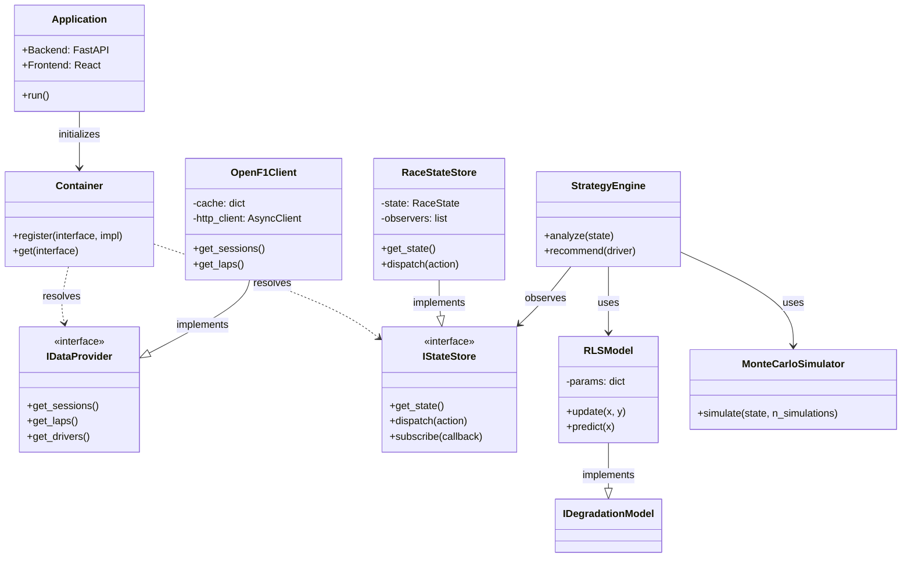

# Architecture Documentation

Complete technical architecture documentation for the F1 Race Strategy Workbench.

---

## Table of Contents

1. [System Overview](#system-overview)
2. [Architecture Diagrams](#architecture-diagrams)
3. [Core Components](#core-components)
4. [Data Flow](#data-flow)
5. [Design Principles](#design-principles)
6. [Directory Structure](#directory-structure)
7. [Key Abstractions](#key-abstractions)
8. [Security Model](#security-model)
9. [Scalability](#scalability)

---

## System Overview

The F1 Race Strategy Workbench is a real-time analytics platform that ingests live F1 timing data, processes it through machine learning models, and provides pit strategy recommendations via REST API and WebSocket.

### High-Level Architecture


### Key Characteristics

| Aspect | Description |
|--------|-------------|
| **Architecture Style** | Event-driven, microservices-ready monolith |
| **Communication** | REST API + WebSocket for real-time updates |
| **Data Source** | OpenF1 public API |
| **State Management** | Immutable state with reducer pattern |
| **ML Pipeline** | Online learning with RLS estimators |

---

## Architecture Diagrams

### System Architecture


### Data Flow


### Component Diagram



---

## Core Components

### 1. Ingest Layer (`src/rsw/ingest/`)

**Purpose:** Fetch and normalize data from external sources.

| Module | Responsibility |
|--------|----------------|
| `base.py` | Abstract `DataProvider` interface, canonical DTOs |
| `openf1_client.py` | OpenF1 API client implementation |

**Key Classes:**
- `DataProvider` — Abstract base for all data sources
- `OpenF1Client` — HTTP client with caching
- `UpdateBatch` — Canonical data format for all providers

```python
# Example: Fetching session data
client = OpenF1Client()
sessions = await client.get_sessions(year=2024)
laps = await client.get_laps(session_key=9999)
```

---

### 2. State Management (`src/rsw/state/`)

**Purpose:** Maintain immutable race state with reducer pattern.

| Module | Responsibility |
|--------|----------------|
| `schemas.py` | Pydantic models for `RaceState`, `DriverState` |
| `store.py` | `RaceStateStore` with observer pattern |
| `reducers.py` | Pure functions for state updates |

**State Structure:**
```python
RaceState:
  ├── session_key: int
  ├── session_name: str
  ├── current_lap: int
  ├── total_laps: int
  ├── drivers: dict[int, DriverState]
  ├── flags: list[str]
  ├── safety_car: bool
  └── timestamp: datetime
```

**Reducer Pattern:**
```python
# Pure function: (state, action) → new_state
new_state = apply_laps(current_state, lap_data)
new_state = apply_positions(new_state, position_data)
```

---

### 3. ML Models (`src/rsw/models/`)

**Purpose:** Real-time prediction of tyre degradation and performance.

| Module | Responsibility |
|--------|----------------|
| `degradation/rls.py` | Recursive Least Squares estimator |
| `degradation/model.py` | Driver-specific degradation models |
| `degradation/manager.py` | Multi-driver model management |
| `features/` | Feature engineering and filtering |

**RLS Estimator:**
- Online learning (updates with each lap)
- Warm-start from compound priors
- Forgetting factor for recency weighting
- Confidence intervals for predictions

```python
# Prediction after training
prediction = model.predict_next_k(k=5)
# Returns: [92.5, 92.6, 92.7, 92.8, 92.9]
```

---

### 4. Strategy Engine (`src/rsw/strategy/`)

**Purpose:** Calculate optimal pit strategies and recommendations.

| Module | Responsibility |
|--------|----------------|
| `pit_window.py` | Optimal pit window calculation |
| `pitloss.py` | Pit stop time loss estimation |
| `monte_carlo.py` | Race outcome simulation |
| `decision.py` | Strategy recommendation engine |
| `explainer.py` | Human-readable explanations |

**Strategy Output:**
```python
StrategyRecommendation:
  ├── recommendation: PIT_NOW | STAY_OUT | CONSIDER_PIT
  ├── confidence: float (0-1)
  ├── pit_window: PitWindow
  ├── expected_position: float
  └── explanation: str
```

---

### 5. API Layer (`src/rsw/api/`)

**Purpose:** REST and WebSocket endpoints.

| Module | Responsibility |
|--------|----------------|
| `routes/health.py` | Health/readiness probes |
| `routes/sessions.py` | Session management |
| `routes/strategy.py` | Strategy endpoints |
| `routes/replay.py` | Historical replay |

**Endpoint Categories:**
- **Health:** `/health`, `/health/live`, `/health/ready`
- **Data:** `/api/sessions`, `/api/state`
- **Strategy:** `/api/strategy/{driver}`
- **Replay:** `/api/replay/sessions`, `/api/replay/{id}/start`

---

### 6. Frontend (`frontend/`)

**Purpose:** React-based user interface.

| Directory | Content |
|-----------|---------|
| `src/components/` | React components |
| `src/hooks/` | Custom hooks (WebSocket, state) |
| `src/services/` | API client services |
| `src/stores/` | Zustand state stores |

---

## Data Flow

### Real-Time Data Pipeline

```
1. OpenF1 API
   │
   ▼
2. OpenF1Client (HTTP fetch + cache)
   │
   ▼
3. UpdateBatch (canonical format)
   │
   ▼
4. Reducers (pure state updates)
   │
   ▼
5. RaceStateStore (immutable state)
   │
   ├──▶ 6a. Strategy Engine (predictions)
   │         │
   │         ▼
   │    6b. Recommendations
   │
   ▼
7. WebSocket Broadcast
   │
   ▼
8. Frontend (React)
```

### Request Lifecycle

1. **Client Request** → FastAPI router
2. **Authentication** → JWT/API key validation
3. **Handler** → Business logic execution
4. **State Access** → Read from RaceStateStore
5. **Response** → JSON serialization
6. **Logging** → Structured log output

---

## Design Principles

### SOLID Principles

| Principle | Implementation |
|-----------|----------------|
| **SRP** | Each service has single responsibility |
| **OCP** | Factories enable extension without modification |
| **LSP** | All implementations substitutable for interfaces |
| **ISP** | Focused interfaces (IDataProvider, ICache) |
| **DIP** | Dependency injection via Container |

### Additional Patterns

| Principle | Implementation |
|-----------|----------------|
| **DRY** | Shared utilities in `utils.py` |
| **KISS** | Simple, clear factory methods |
| **Separation of Concerns** | Layered architecture |
| **Immutability** | Immutable state with reducers |
| **Observer Pattern** | WebSocket state broadcasting |

---

## Directory Structure

```
src/rsw/
├── __init__.py
├── main.py                 # FastAPI application entry
├── config.py               # Configuration loading
├── exceptions.py           # Custom exception hierarchy
├── interfaces.py           # Abstract base classes
├── container.py            # Dependency injection
├── utils.py                # Shared utilities
├── domain.py               # Value objects
├── factories.py            # Factory patterns
│
├── api/                    # REST API layer
│   ├── __init__.py
│   └── routes/
│       ├── health.py
│       ├── sessions.py
│       ├── strategy.py
│       └── replay.py
│
├── ingest/                 # Data ingestion
│   ├── __init__.py
│   ├── base.py             # Abstract DataProvider
│   └── openf1_client.py    # OpenF1 implementation
│
├── state/                  # State management
│   ├── __init__.py
│   ├── schemas.py          # Pydantic models
│   ├── store.py            # State store
│   └── reducers.py         # Pure update functions
│
├── models/                 # ML models
│   ├── __init__.py
│   ├── degradation/
│   │   ├── rls.py          # RLS estimator
│   │   ├── model.py        # Driver model
│   │   └── manager.py      # Multi-driver manager
│   └── features/
│       ├── builder.py      # Feature engineering
│       └── filters.py      # Data filtering
│
├── strategy/               # Strategy engine
│   ├── __init__.py
│   ├── pit_window.py       # Pit window calculation
│   ├── pitloss.py          # Pit loss estimation
│   ├── monte_carlo.py      # Race simulation
│   ├── decision.py         # Recommendations
│   └── explainer.py        # Explanations
│
├── services/               # Business logic
│   ├── session_service.py
│   ├── strategy_service.py
│   └── replay_service.py
│
├── repositories/           # Data access
│   └── session_repository.py
│
└── middleware/             # HTTP middleware
    ├── auth.py             # Authentication
    └── logging.py          # Request logging
```

---

## Key Abstractions

### DataProvider Interface

```python
class DataProvider(ABC):
    @abstractmethod
    async def get_sessions(...) -> list[SessionInfo]: ...
    
    @abstractmethod
    async def get_laps(...) -> list[LapData]: ...
    
    @abstractmethod
    async def get_drivers(...) -> list[DriverInfo]: ...
```

### Factory Pattern

```python
class DataProviderFactory:
    @staticmethod
    def create(provider_type: str) -> DataProvider:
        if provider_type == "openf1":
            return OpenF1Client()
        elif provider_type == "fastf1":
            return FastF1Client()
        raise ValueError(f"Unknown provider: {provider_type}")
```

### Dependency Injection

```python
class Container:
    _instances: dict[type, Any] = {}
    
    @classmethod
    def get(cls, interface: type[T]) -> T:
        return cls._instances[interface]
    
    @classmethod
    def register(cls, interface: type, impl: Any) -> None:
        cls._instances[interface] = impl
```

---

## Security Model

### Authentication

| Method | Use Case |
|--------|----------|
| JWT Bearer | User authentication |
| API Key | Service-to-service |
| None | Development mode |

### Authorization

- Role-based access (admin, user, api_user)
- Permission checking via decorators
- Rate limiting per API key

### Security Features

- CORS configuration
- Input validation (Pydantic)
- SQL injection prevention (parameterized queries)
- XSS protection (React escaping)

---

## Scalability

### Horizontal Scaling

```
                    Load Balancer
                         │
         ┌───────────────┼───────────────┐
         │               │               │
    ┌────▼────┐    ┌────▼────┐    ┌────▼────┐
    │  App 1  │    │  App 2  │    │  App 3  │
    └────┬────┘    └────┬────┘    └────┬────┘
         │               │               │
         └───────────────┼───────────────┘
                         │
                    ┌────▼────┐
                    │  Redis  │ (shared state)
                    └─────────┘
```

### Caching Strategy

| Level | Cache | TTL |
|-------|-------|-----|
| API Response | In-memory | 5s |
| Session Data | Redis | 1h |
| Historical | Disk | 24h |

### Performance Targets

| Metric | Target |
|--------|--------|
| API Latency (p95) | < 100ms |
| WebSocket Latency | < 50ms |
| Concurrent Users | 1000+ |
| Memory per Instance | < 512MB |

---

## Next Steps

- [API Reference](API.md) — Detailed endpoint documentation
- [Deployment Guide](DEPLOYMENT.md) — Production deployment
- [Development Guide](DEVELOPMENT.md) — Contributing code

---
**Next:** [[API-Reference]]
